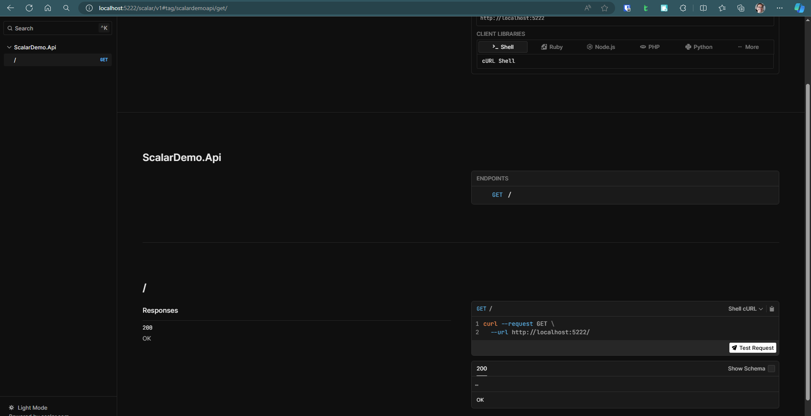
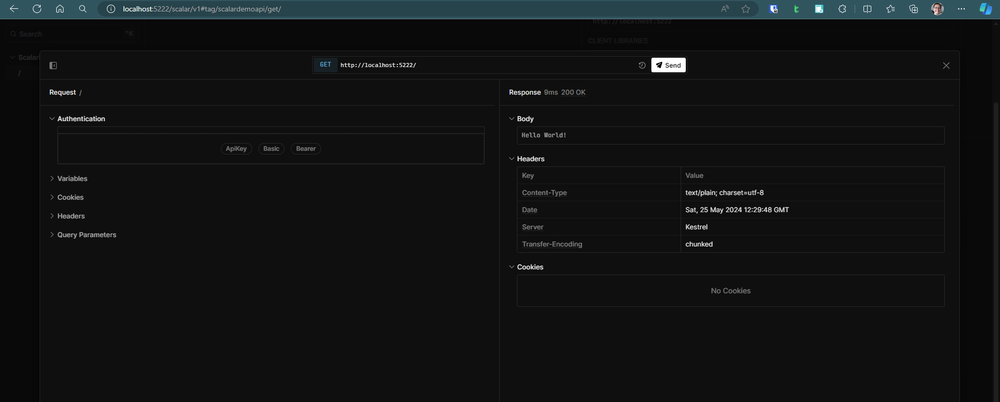

# Scalar Swagger Editor UI Demo

.NET 9.0 will be removing built-in support for Swagger UI. Instead, we can use Scalar to generate beautiful API references from OpenAPI/Swagger files.

[Scalar - Document, Test & Discover APIs](https://scalar.com/)

[scalar/scalar: Beautiful API references from OpenAPI/Swagger files ✨](https://github.com/ScalaR/ScalaR)

[Get started with Microsoft.AspNetCore.OpenApi | Microsoft Learn](https://learn.microsoft.com/en-us/aspnet/core/fundamentals/minimal-apis/aspnetcore-openapi?view=aspnetcore-9.0&tabs=visual-studio#using-scalar-for-interactive-api-documentation)

[Swagger is Going Away in .NET 9! - YouTube](https://www.youtube.com/watch?v=8xEkVmqlr4I&sttick=0)

## How to use

```sh
$ tree -L 5
.
|-- Directory.Build.props
|-- Directory.Packages.props
|-- README.md
|-- ScalarDemo.sln
|-- nuget.config
`-- src
    `-- ScalarDemo.Api
        |-- Modules
        |   `-- ScalarModule
        |       |-- ScalarExtensions.cs
        |       `-- ScalarOptions.cs
        |-- Program.cs
        |-- Properties
        |   `-- launchSettings.json
        |-- ScalarDemo.Api.csproj
        |-- appsettings.Development.json
        |-- appsettings.json
```

`Directory.Build.props`

Provides a solution wide configuration for all projects in the solution.

```xml
<Project>
  <PropertyGroup>
    <TargetFramework>net9.0</TargetFramework>
    <ImplicitUsings>enable</ImplicitUsings>
    <Nullable>enable</Nullable>
    <LangVersion>12.0</LangVersion>
    <EnforceCodeStyleInBuild>true</EnforceCodeStyleInBuild>
  </PropertyGroup>
</Project>
```

`Directory.Packages.props`:

Provides central versioning for all packages in the solution.

```xml
<Project>
  <PropertyGroup>
    <ManagePackageVersionsCentrally>true</ManagePackageVersionsCentrally>
  </PropertyGroup>
  <ItemGroup>
    <PackageVersion Include="Microsoft.AspNetCore.OpenApi" Version="9.0-preview.4.24267.6" />
  </ItemGroup>
</Project>
```

`nuget.config`:

Sets the package source to the default NuGet feed.

```xml
<?xml version="1.0" encoding="utf-8"?>
<configuration>
    <packageSources>
        <!--To
        inherit the global NuGet package sources remove the <clear/> line below -->
        <clear />
        <add key="nuget" value="https://api.nuget.org/v3/index.json" />
    </packageSources>
</configuration>
```

`.editorconfig`:

Enforces code style during build

This rule for example enforces that all files have file based namespaces and causes an error during build if any file is not using file based namespaces declarations.

```editorconfig
# IDE0161: Convert to file-scoped namespace
csharp_style_namespace_declarations = file_scoped:error
dotnet_diagnostic.IDE0161.severity = error
```

This may sometimes be problematic when using other tools like EF Core Migrations which still generates brace style namespace declarations.

[entity framework - How to handle huge efcore migrations designer files that is slowing down build and IDE - Stack Overflow](https://stackoverflow.com/questions/52627277/how-to-handle-huge-efcore-migrations-designer-files-that-is-slowing-down-build-a)

Maybe an editorconfig file can be added to the project to disable this rule for the migrations folder.

Or manually fix migrations files to use file based namespace declarations.

Add OpenAPI

```sh
cd src/ScalarDemo.Api
dotnet add package Microsoft.AspNetCore.OpenApi --version 9.0-preview.4.24267.6
```

Install .NET 9 SDK (v9.0.100-preview.4)

[Download .NET 9.0 (Linux, macOS, and Windows)](https://dotnet.microsoft.com/en-us/download/dotnet/9.0)

Reference files from:

[scalar/packages/scalar.aspnetcore/README.md at main · scalar/scalar](https://github.com/scalar/scalar/blob/main/packages/scalar.aspnetcore/README.md)

```csharp

using ScalarDemo.Api;

var builder = WebApplication.CreateBuilder(args);

builder.Services.AddOpenApi();

var app = builder.Build();

// Makes the open api specification available at /openapi/v1.json for production 
// Move to IsDevelopment() check if you only want make it available in development
app.MapOpenApi(); 

if (app.Environment.IsDevelopment())
{
    // Enable to endpoint to view the Scalar UI
    // Ensure that the launchSettings.json 
    // Sets the "launchUrl": "scalar/v1", where v1 is the document name    
    // The default document name is v1
    app.MapScalarUI(options => { });
}

app.MapGet("/", () => "Hello World!");

app.Run();
```

Run the application

```sh
cd src/ScalarDemo.Api
dotnet run
```

Navigate to `https://localhost:5222/scalar/v1`

The Scalar UI is a beautiful API reference from OpenAPI/Swagger files.



We can test the documented endpoints from the UI just like Swagger UI.


